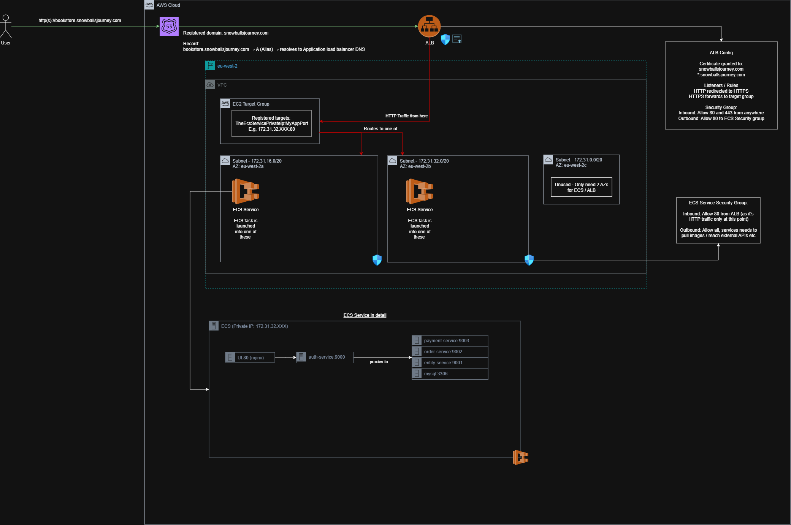

# Overview

A microservices project demonstrating use of Spring Boot, React, and AWS deployment patterns. Initially I had planned to deploy to EKS but instead using ECS on Fargate due to it being cheaper. Even that was costing a few quid per day so it's been scaled down to save money.

Developed using Claude Sonnet 4.5 - identifiable by the use of emojis in deployment scripts! 🚀

## AWS Architecture



## ECS / Service Architecture

A React + TypeScript frontend communicating with a microservices backend through an API gateway (Spring Cloud API Gateway).

```
Browser (React + Vite)
    ↓
Auth Service (Spring Cloud Gateway)
    ↓
├─→ Entity Service (Books, Authors)
├─→ Order Service (Cart, Orders)
└─→ Payment Service (Stripe Integration)
    ↓
MySQL Database (Shared)
```

## Tech Stack

**Frontend:**
- React 18 + TypeScript
- Vite
- Material-UI
- React Router
- Axios

**Backend:**
- Java 21
- Spring Boot 3.x
- Spring Security (OAuth2 Resource Server for the built-in JWT filter)
- Spring Cloud Gateway (API routing)
- OpenFeign (inter-service communication)
- jOOQ
- Liquibase
- JWT authentication

**Infrastructure:**
- Docker + Docker Compose (local development)
- Kubernetes + Helm (local k8s testing)
- AWS ECS Fargate (production)
- AWS ECR (container registry)
- AWS Secrets Manager (credentials)
- MySQL 9.0

**Build & Deployment:**
- Multi-module Maven project
- Does have cypress tests which are WIP

## Deployment

1. **Local Development:** `mvn spring-boot:run` (backend) + `npm run dev` (frontend)
2. **Docker Compose:** Full stack with single `docker compose up`
3. **Local Kubernetes:** Helm charts for kind, `cd helm && ./deploy-local-k8s.sh`
4. **AWS ECS Fargate:** 'Production' deployment, WIP currently.

## Design Decisions

### Tab-Specific Sessions
Each browser tab maintains its own session for multi-user testing:
- JWT tokens stored in `sessionStorage` (not `localStorage` or cookies)
- Spring Security configured as stateless (no server-side sessions)
- Authorization header sent with each request
- Closing tab clears the token automatically

This design allows testing multiple concurrent users from a single browser by opening multiple tabs.

### Shared Database
All microservices share a single MySQL database rather than the typical "database-per-service" pattern. This was to simplify deployment and lower costs.
